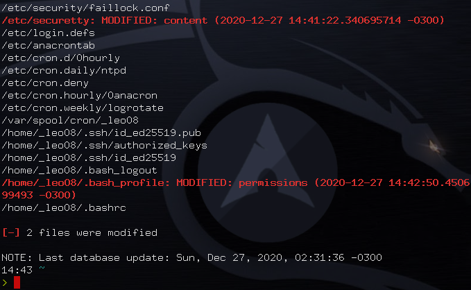

# sids
> A lightweight and simple HIDS (Host-based Intrusion Detection System) written in Bash

Example image of a `sids` check output.

## Description

`sids` creates a database of files (with the `-i` option) specfied in the configuration file. This database stores hashes, permissions, and ownership data for each monitored file. Later, via the `-c` option, it checks the current status of each monitored file against the data stored in the database. If something do not match, `sids` will let you know, as shown in the image above.
